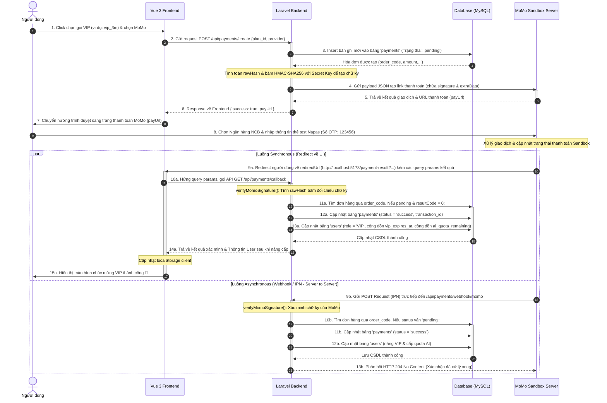

# BÁO CÁO THUYẾT TRÌNH: CHỨC NĂNG THANH TOÁN MOMO & TỰ ĐỘNG NÂNG CẤP VIP

Tài liệu này tổng hợp toàn bộ quy trình thiết kế, luồng đi dữ liệu (Data Flow), mối liên kết giữa các file và cách sửa các lỗi thực tế từ đầu đến cuối của chức năng **Thanh toán MoMo Sandbox** trong dự án **QuizFlex** để bạn tự tin thuyết trình trước giáo viên.

---

## I. SƠ ĐỒ LUỒNG HOẠT ĐỘNG (SEQUENCE DIAGRAM)

Dưới đây là sơ đồ tương tác mô tả chi tiết luồng thông tin đi qua các thành phần: **Người dùng, Vue 3 Frontend, Laravel Backend, Cổng MoMo Sandbox, và Cơ sở dữ liệu (MySQL).**



---

## II. DANH SÁCH CÁC FILE LIÊN QUAN VÀ NHIỆM VỤ CHI TIẾT

Chức năng thanh toán được phân tách theo mô hình **Client-Server MVC & Service Pattern** nhằm đảm bảo tính tái sử dụng và bảo mật cao:

### 1. Phía Frontend (Vue 3 / Vite)
*   **[router.js](file:///c:/laragon/www/QuizFlex/fe_quizflex/src/router/router.js)**:
    *   *Nhiệm vụ*: Định nghĩa route `/upgrade` cho trang chọn gói và `/payment-result` để hứng thông tin redirect từ MoMo.
*   **[api.js](file:///c:/laragon/www/QuizFlex/fe_quizflex/src/services/api.js)**:
    *   *Nhiệm vụ*: Chứa đối tượng `paymentsApi` quản lý Axios call giao tiếp với backend:
        *   `create()`: Gửi yêu cầu khởi tạo thanh toán lên backend.
        *   `callback()`: Gửi thông tin xác minh sau khi MoMo redirect về.
        *   `history()`: Lấy lịch sử giao dịch.
*   **[Upgrade.vue](file:///c:/laragon/www/QuizFlex/fe_quizflex/src/views/user/Upgrade.vue)**:
    *   *Nhiệm vụ*: Giao diện hiển thị các gói VIP (`vip_1m`, `vip_3m`, `vip_1y`), modal chọn cổng thanh toán MoMo và bảng lịch sử giao dịch. Gọi API `paymentsApi.create()` để lấy `payUrl` và chuyển hướng trình duyệt.
*   **[PaymentResult.vue](file:///c:/laragon/www/QuizFlex/fe_quizflex/src/views/user/PaymentResult.vue)**:
    *   *Nhiệm vụ*: Trang hiển thị trạng thái giao dịch cho người dùng. Bắt toàn bộ các tham số trên URL (`orderId`, `signature`, `resultCode`...), gọi API `paymentsApi.callback()` để đồng bộ trạng thái backend. Nếu backend xác thực thành công, nó cập nhật ngay thông tin User trong `localStorage` để thay đổi giao diện (Avatar VIP, số lượt dùng AI tăng) mà không cần tải lại trang.

### 2. Phía Backend (Laravel 10)
*   **[api.php](file:///c:/laragon/www/QuizFlex/be_quizflex/routes/api.php)**:
    *   *Nhiệm vụ*: Khai báo các route API cho thanh toán:
        *   `POST /payments/create`: Khởi tạo đơn hàng (Cần bảo mật JWT).
        *   `GET /payments/history`: Xem lịch sử giao dịch cá nhân/hệ thống (Cần bảo mật JWT).
        *   `GET /payments/callback`: Nhận kết quả từ Frontend Redirect.
        *   `POST /payments/webhook/momo`: Webhook nhận tín hiệu IPN không đồng bộ trực tiếp từ MoMo Server.
*   **[PaymentController.php](file:///c:/laragon/www/QuizFlex/be_quizflex/app/Http/Controllers/PaymentController.php)**:
    *   *Nhiệm vụ*: Điều hướng nghiệp vụ (Controller). Tiếp nhận request, thực hiện validate dữ liệu đầu vào, gọi service xử lý và trả về phản hồi JSON tiêu chuẩn.
*   **[PaymentService.php](file:///c:/laragon/www/QuizFlex/be_quizflex/app/Services/Payment/PaymentService.php)**:
    *   *Nhiệm vụ*: Xử lý logic nghiệp vụ cốt lõi (Service Layer). Thực hiện:
        *   Định nghĩa cấu trúc giá tiền và thời hạn VIP (`getPlans()`).
        *   Sinh mã đơn hàng `orderCode` dựa trên ID người dùng.
        *   Tạo chữ ký số bảo mật `HMAC-SHA256` gửi lên MoMo.
        *   Gửi request POST sang API MoMo để lấy `payUrl`.
        *   Xác minh tính toàn vẹn của chữ ký MoMo gửi lại (`verifyMomoSignature`).
        *   Cập nhật cơ sở dữ liệu khi thanh toán thành công: nâng VIP tài khoản, cộng dồn hạn VIP và quota AI.
*   **[CheckVip.php](file:///c:/laragon/www/QuizFlex/be_quizflex/app/Http/Middleware/CheckVip.php)**:
    *   *Nhiệm vụ*: Middleware bảo vệ. Chặn các request gọi tính năng VIP (ví dụ: AI sinh đề thi), kiểm tra nếu user có role `VIP` hoặc `ADMIN` và thời hạn `vip_expires_at` còn hiệu lực thì mới cho đi tiếp, ngược lại trả về lỗi `403`.
*   **[User.php](file:///c:/laragon/www/QuizFlex/be_quizflex/app/Models/User.php) & [Payment.php](file:///c:/laragon/www/QuizFlex/be_quizflex/app/Models/Payment.php)**:
    *   *Nhiệm vụ*: Các Eloquent Model đại diện cho bảng dữ liệu `users` và `payments` để thao tác truy vấn CSDL.
*   **[services.php](file:///c:/laragon/www/QuizFlex/be_quizflex/config/services.php) & [.env](file:///c:/laragon/www/QuizFlex/be_quizflex/.env)**:
    *   *Nhiệm vụ*: Lưu trữ cấu hình Sandbox MoMo.

---

## III. MỐI LIÊN KẾT GIỮA CÁC THÀNH PHẦN (DATA FLOW DETAIL)

Sự tương tác giữa **Frontend, API Endpoint, Logic Hàm, và Cơ sở dữ liệu** được liên kết chặt chẽ qua các bước sau đây:

### 1. Sơ đồ mô tả trực quan dòng chảy dữ liệu:
```
[UI: Upgrade.vue] 
      │ (Chọn gói VIP & bấm nút thanh toán)
      ▼
[API POST: /api/payments/create] ──> [PaymentController::create()]
                                              │
                                              ▼
                                     [PaymentService::createMomoPayment()]
                                              │
         ┌────────────────────────────────────┴──────────────────────────────────────┐
         ▼ (Tạo hóa đơn tạm ở DB)                                                   ▼ (Bảo mật: Hash signature)
  [Insert 'payments': status='pending']                                        [Băm HMAC-SHA256 với Secret Key]
         │                                                                           │
         └────────────────────────────────────┬──────────────────────────────────────┘
                                              ▼
                                   [HTTP Post to MoMo API] 
                                              │ (Nhận payUrl)
                                              ▼
[UI: Chuyển hướng MoMo Gateway] ──> [Người dùng nhập thông tin thẻ & OTP thành công]
                                              │
         ┌────────────────────────────────────┴──────────────────────────────────────┐
         ▼ (Redirect đồng bộ qua Frontend)                                           ▼ (IPN bất đồng bộ Server-to-Server)
  [Redirect: /payment-result]                                                  [API POST: /api/payments/webhook/momo]
         │                                                                           │
         ▼ (Gọi API đồng bộ)                                                         ▼
  [API GET: /api/payments/callback]                                            [PaymentController::webhookMomo()]
         │                                                                           │
         ▼                                                                           ▼
  [PaymentController::callback()]                                            [PaymentService::verifyMomoSignature()]
         │                                                                           │ (Xác thực chữ ký phản hồi khớp 100%)
         └────────────────────────────────────┬──────────────────────────────────────┘
                                              ▼
                                   [PaymentService::processSuccessPayment()]
                                              │
         ┌────────────────────────────────────┴──────────────────────────────────────┐
         ▼ (Cập nhật hóa đơn)                                                        ▼ (Kích hoạt đặc quyền người dùng)
  [Update 'payments': status='success']                                        [Update 'users': role='VIP', expires, quota]
```

### 2. Luồng giao tiếp tuần tự chi tiết (Step-by-step):

#### Giai đoạn A: Khởi tạo giao dịch (Frontend -> Backend -> MoMo Sandbox)
1. **Người dùng tương tác**: Người dùng bấm nút nâng cấp tại giao diện gói VIP trên file **[Upgrade.vue](file:///c:/laragon/www/QuizFlex/fe_quizflex/src/views/user/Upgrade.vue)**.
2. **Kích hoạt hàm Client**: Hàm `handlePayment('momo')` được gọi, kích hoạt Axios request qua đối tượng `paymentsApi.create(...)` trong tệp **[api.js](file:///c:/laragon/www/QuizFlex/fe_quizflex/src/services/api.js)**.
3. **Gửi HTTP Request POST**: Request được gửi đến Endpoint `/api/payments/create` của backend kèm JSON payload: `{"plan_id": "vip_3m", "provider": "momo"}`.
4. **Nhận request và Điều hướng**: Router tại **[api.php](file:///c:/laragon/www/QuizFlex/be_quizflex/routes/api.php)** chuyển yêu cầu đến hàm `create(Request $request)` của **[PaymentController.php](file:///c:/laragon/www/QuizFlex/be_quizflex/app/Http/Controllers/PaymentController.php)**.
5. **Gọi Service Layer**: Controller xác thực user hiện tại qua token JWT và chuyển dữ liệu sang hàm `createMomoPayment($user, 'vip_3m')` tại **[PaymentService.php](file:///c:/laragon/www/QuizFlex/be_quizflex/app/Services/Payment/PaymentService.php)**.
6. **Insert DB tạm thời & Băm chữ ký**: 
   * Hàm `createMomoPayment` thêm hóa đơn mới vào bảng `payments` ở trạng thái `pending` thông qua Eloquent Model **[Payment.php](file:///c:/laragon/www/QuizFlex/be_quizflex/app/Models/Payment.php)**.
   * Tính toán chữ ký điện tử `HMAC-SHA256` với `secretKey` bảo mật để bảo vệ chống giả mạo.
7. **Gửi POST sang MoMo Server**: Backend kết nối HTTP Client gửi yêu cầu tạo link giao dịch sang MoMo và nhận về phản hồi chứa đường dẫn thanh toán `payUrl`.
8. **Trả payUrl về Frontend**: Link `payUrl` được trả về Controller dưới dạng mảng rồi phản hồi dạng JSON cho Frontend.
9. **Chuyển hướng MoMo**: File **[Upgrade.vue](file:///c:/laragon/www/QuizFlex/fe_quizflex/src/views/user/Upgrade.vue)** nhận được kết quả và chạy lệnh `window.location.href = res.payUrl` để đưa trình duyệt sang MoMo Gateway.

#### Giai đoạn B: Thực hiện giao dịch tại MoMo Sandbox
10. **Thanh toán thành công**: Khách hàng nhập thông tin thẻ ảo NCB trên giao diện MoMo Sandbox. Giao dịch thành công, MoMo gửi 2 luồng kết quả:
    * Luồng redirect đồng bộ đưa trình duyệt về Frontend `http://localhost:5173/payment-result` kèm chuỗi query string.
    * Luồng IPN Webhook gửi POST bất đồng bộ Server-to-Server trực tiếp đến `/api/payments/webhook/momo` của backend.

#### Giai đoạn C: Xác minh kết quả & Nâng cấp VIP (MoMo -> Backend -> Frontend)
11. **Frontend hứng redirect**: Trang **[PaymentResult.vue](file:///c:/laragon/www/QuizFlex/fe_quizflex/src/views/user/PaymentResult.vue)** bắt các tham số kết quả trên URL và gọi GET API Axios `paymentsApi.callback(queryParams)`.
12. **Backend verify chữ ký số**: 
    * Router **[api.php](file:///c:/laragon/www/QuizFlex/be_quizflex/routes/api.php)** chuyển tiếp đến hàm `callback()` của **[PaymentController.php](file:///c:/laragon/www/QuizFlex/be_quizflex/app/Http/Controllers/PaymentController.php)**.
    * Controller chuyển tiếp dữ liệu sang hàm `verifyMomoSignature($data)` ở **[PaymentService.php](file:///c:/laragon/www/QuizFlex/be_quizflex/app/Services/Payment/PaymentService.php)** để băm đối chiếu chữ ký phản hồi bảo mật.
13. **Kích hoạt nâng cấp VIP**: 
    * Nếu chữ ký khớp 100% và giao dịch thành công (`resultCode == 0`), Controller gọi hàm `processSuccessPayment(...)` trong Service.
    * Hàm này cập nhật trạng thái hóa đơn sang `success` ở bảng `payments` và sửa đổi quyền hạn người dùng sang `VIP`, gia hạn hạn dùng `vip_expires_at` cùng AI Quota `ai_quota_remaining` ở bảng `users` trong MySQL.
14. **Phản hồi về Frontend**: Backend trả về JSON chứa trạng thái VIP mới của User.
15. **Frontend cập nhật UI realtime**: File **[PaymentResult.vue](file:///c:/laragon/www/QuizFlex/fe_quizflex/src/views/user/PaymentResult.vue)** nhận kết quả thành công, ghi đè thông tin User mới vào LocalStorage qua lệnh `currentUserStorage.set(res.user)` giúp giao diện đổi sang giao diện VIP ngay lập tức mà không cần reload trang.

---

## IV. GIẢI THÍCH CHI TIẾT CÁC HÀM QUAN TRỌNG

### 1. Hàm tạo giao dịch: `createMomoPayment(User $user, string $planId)`
*   **Mục đích**: Chuẩn bị hóa đơn, tính toán chữ ký số bảo mật gửi sang MoMo để lấy liên kết thanh toán (`payUrl`).
*   **Dữ liệu truyền vào (Input)**:
    *   `$user`: Đối tượng User đang đăng nhập.
    *   `$planId`: Mã gói cước chọn mua (`vip_1m`, `vip_3m`, `vip_1y`).
*   **Quy trình xử lý**:
    1.  Lấy thông tin gói cước từ hàm cấu hình `getPlans()` để lấy số tiền thực tế cần thanh toán.
    2.  Sinh mã đơn hàng `orderCode`: `'QF_' . strtoupper(uniqid()) . '_' . $user->id`.
    3.  Tạo một bản ghi hóa đơn tạm thời trong cơ sở dữ liệu với trạng thái `pending`.
    4.  Mã hóa thông tin bổ sung (`extraData`) bằng Base64 chứa ID gói cước và ID người dùng để nhận diện lại khi MoMo phản hồi: `base64_encode(json_encode(['plan_id' => $planId, 'user_id' => $user->id]))`.
    5.  Thiết lập `requestType` là `"payWithATM"` để cho phép thanh toán giả lập bằng thẻ Napas trên trình duyệt.
    6.  Ghép chuỗi `$rawHash` theo đúng quy định bảng chữ cái và thứ tự các trường của MoMo.
    7.  Băm SHA256 chuỗi raw đó với `secretKey` để tạo ra `signature`.
    8.  Gọi API POST sang MoMo Endpoint, giải mã kết quả nhận về để lấy `payUrl`.
*   **Dữ liệu trả về (Output)**: Một mảng chứa liên kết thanh toán `payUrl`, mã đơn hàng `order_code` và đối tượng `payment`.

### 2. Hàm xác minh chữ ký: `verifyMomoSignature(array $data)`
*   **Mục đích**: Bảo vệ hệ thống khỏi các cuộc tấn công giả mạo tham số (ví dụ: hacker tự sửa kết quả thành công hoặc sửa số tiền thanh toán từ 120.000đ thành 100đ).
*   **Dữ liệu truyền vào (Input)**: Mảng `$data` chứa toàn bộ các tham số do MoMo trả về (trên URL redirect hoặc payload Webhook).
*   **Quy trình xử lý**:
    1.  Lấy ra chữ ký nhận được từ MoMo: `$receivedSignature = $data['signature']`.
    2.  Trích xuất các tham số nghiệp vụ như `amount`, `orderId`, `resultCode`, `transId`...
    3.  Ghép các tham số này cùng với `accessKey` hệ thống thành chuỗi thô `$rawHash` đúng thứ tự ký tự Alphabet định sẵn.
    4.  Băm chuỗi thô `$rawHash` bằng thuật toán HMAC-SHA256 sử dụng `secretKey` lưu trữ an toàn trong `.env` của backend: `$computedSignature = hash_hmac("sha256", $rawHash, $this->secretKey)`.
    5.  Sử dụng hàm `hash_equals()` (hàm so sánh chuỗi an toàn, chống tấn công Timing Attack) đối chiếu chữ ký tự tính toán (`$computedSignature`) với chữ ký nhận về (`$receivedSignature`).
*   **Dữ liệu trả về (Output)**: Kiểu boolean (`true` nếu khớp 100%, `false` nếu lệch).

### 3. Hàm nâng cấp VIP và cấp hạn mức AI: `processSuccessPayment(Payment $payment, string $transactionId, array $rawResponse)`
*   **Mục đích**: Kích hoạt VIP và nạp hạn mức AI cho người dùng khi giao dịch thành công.
*   **Dữ liệu truyền vào (Input)**:
    *   `$payment`: Đối tượng Model của hóa đơn cần xử lý.
    *   `$transactionId`: Mã giao dịch thực tế từ MoMo.
    *   `$rawResponse`: Toàn bộ dữ liệu phản hồi thô để lưu vết.
*   **Quy trình xử lý**:
    1.  Kiểm tra trạng thái hóa đơn. Nếu status đã là `success`, lập tức trả về (tránh lỗi double-processing do Webhook và Callback chạy song song).
    2.  Cập nhật trạng thái hóa đơn sang `success`, gán mã giao dịch, thời gian thanh toán `paid_at` và phản hồi của MoMo vào database.
    3.  Ánh xạ số tiền hóa đơn (`$payment->amount`) để tìm gói cước tương ứng nhằm lấy số ngày VIP và quota AI.
    4.  Cập nhật thông tin User liên kết:
        *   Đổi `role` từ `'USER'` thành `'VIP'`.
        *   Cộng dồn thời gian hết hạn `vip_expires_at`: Nếu tài khoản đang còn hạn VIP thì cộng dồn thêm số ngày của gói mới, ngược lại thì tính bằng thời gian hiện tại cộng thêm số ngày.
        *   Cộng dồn quota sử dụng AI (`ai_quota_remaining`) tương ứng với gói.
        *   Lưu thay đổi xuống Database.
*   **Dữ liệu trả về (Output)**: Đối tượng `$payment` đã được cập nhật.

---

## V. CƠ SỞ DỮ LIỆU LIÊN QUAN VÀ CẬP NHẬT TRẠNG THÁI

Tính năng này tác động trực tiếp đến hai bảng dữ liệu trong MySQL:

### 1. Bảng `payments` (Lịch sử giao dịch)
Lưu vết tất cả hóa đơn thanh toán của người dùng.

| Trường dữ liệu | Kiểu dữ liệu | Ý nghĩa |
| :--- | :--- | :--- |
| `id` | `bigint` (PK) | Khóa chính tự tăng. |
| `user_id` | `bigint` (FK) | Liên kết đến bảng `users` (người thực hiện). |
| `order_code` | `string` (Unique) | Mã đơn hàng gửi sang MoMo (ví dụ: `QF_647FB8A1_5`). |
| `amount` | `decimal` | Số tiền giao dịch (VND). |
| `provider` | `enum('momo', 'vnpay')` | Cổng thanh toán sử dụng. |
| `status` | `enum` | Trạng thái: `pending`, `success`, `failed`, `refunded`. |
| `transaction_id` | `string` (Nullable) | Mã giao dịch thực tế trên cổng MoMo. |
| `provider_response`| `json` (Nullable) | Toàn bộ phản hồi JSON thô từ MoMo phục vụ đối soát. |
| `paid_at` | `timestamp` | Thời điểm thanh toán thành công. |

*   **Quy trình đổi trạng thái**:
    1.  Khi người dùng click chọn thanh toán: tạo bản ghi mới có `status = 'pending'`.
    2.  Khi nhận tín hiệu callback/webhook có `resultCode = 0`: Cập nhật `status = 'success'`.
    3.  Khi nhận kết quả `resultCode != 0` (hủy bỏ, hết tiền, lỗi thẻ...): Cập nhật `status = 'failed'`.

### 2. Bảng `users` (Thông tin tài khoản)
Quản lý quyền hạn và hạn mức dịch vụ của người dùng.

| Trường dữ liệu | Kiểu dữ liệu | Ý nghĩa |
| :--- | :--- | :--- |
| `role` | `enum` | Quyền: `GUEST`, `USER`, `VIP`, `ADMIN`. |
| `ai_quota_remaining`| `integer` | Số lượt còn lại được phép gọi AI để sinh đề thi. |
| `vip_expires_at` | `timestamp` | Hạn cuối sử dụng đặc quyền VIP. |

*   **Quy trình nâng cấp VIP**:
    *   Đổi `role` sang `'VIP'`.
    *   Gia hạn `vip_expires_at`: `vip_expires_at = MAX(vip_expires_at, hiện tại) + số_ngày_gói_mua`.
    *   Cộng quota AI: `ai_quota_remaining = ai_quota_remaining + quota_gói_mua`.

---

## VI. CƠ CHẾ BẢO MẬT TRONG THANH TOÁN

QuizFlex triển khai 3 tầng bảo mật cốt lõi để bảo vệ giao dịch:

### 1. Cơ chế Chữ ký số (Digital Signature - HMAC-SHA256)
*   **Nguyên lý**: Khi gửi yêu cầu hoặc nhận phản hồi, dữ liệu thô (`$rawHash`) được ghép lại từ các tham số theo thứ tự Alphabet và được băm bằng thuật toán mật mã khóa đối xứng `HMAC-SHA256` cùng với một mã khóa bí mật (`secretKey` chỉ backend biết).
*   **Mục đích**: Đảm bảo **tính toàn vẹn dữ liệu** (Integrity) và **chống chối bỏ** (Non-repudiation).
*   **Ví dụ tấn công và cách phòng thủ**: Nếu hacker dùng Postman gửi request giả mạo MoMo báo giao dịch thành công cho đơn hàng của họ, hệ thống backend sẽ lấy dữ liệu nhận về tự băm lại với `secretKey`. Vì hacker không biết `secretKey` nên chữ ký băm ra sẽ bị lệch so với chữ ký hacker gửi lên. Giao dịch giả mạo bị từ chối lập tức.

### 2. Cơ chế IPN (Instant Payment Notification) hay Webhook
*   **Nguyên lý**: Ngoài việc redirect người dùng về giao diện web (đây là kênh phía Client, dễ bị mất mạng hoặc tắt trình duyệt làm gián đoạn), MoMo sẽ gửi thêm một request POST không đồng bộ (Server-to-Server) trực tiếp đến API `/api/payments/webhook/momo` của backend.
*   **Mục đích**: Đảm bảo **tính chính xác & tin cậy** của trạng thái hóa đơn ngay cả khi trình duyệt của người dùng bị tắt đột ngột, đảm bảo khách hàng trả tiền thì chắc chắn sẽ được kích hoạt dịch vụ.

### 3. Phòng chống tấn công Double-Spending (Chi tiêu kép)
*   Do luồng Redirect Callback và IPN Webhook chạy song song, có khả năng cả hai cổng cùng gọi hàm cập nhật database gần như đồng thời.
*   **Giải pháp**: Trong hàm `processSuccessPayment()`, backend kiểm tra trạng thái trước:
    ```php
    if ($payment->status === 'success') {
        return $payment; // Bỏ qua nếu đã xử lý thành công trước đó
    }
    ```
    Điều này giúp tránh việc cộng dồn hạn VIP hai lần cho cùng một hóa đơn thanh toán duy nhất.

---

## VII. PHÂN TÍCH HAI LỖI CHỮ KÝ THỰC TẾ ĐÃ KHẮC PHỤC

Trong quá trình tích hợp thực tế với cổng MoMo Sandbox thật, hệ thống ban đầu gặp lỗi lệch chữ ký giao dịch thất bại và đã được giải quyết triệt để:

### Lỗi 1: Lệch chữ ký do mã hóa URL (URL-Encoding) các ký tự tiếng Việt có dấu
*   **Vị trí lỗi**: Tham số `orderInfo` (mô tả hóa đơn) gửi đi ban đầu có tiếng Việt: `"Nang cap VIP QuizFlex - VIP 3 Tháng"`.
*   **Cơ chế phát sinh**:
    1.  Backend gửi chuỗi tiếng Việt có dấu sang MoMo.
    2.  Khi MoMo chuyển hướng người dùng quay lại Frontend qua URL redirect, trình duyệt tự động mã hóa ký tự Unicode thành dạng URL-encoded. Tuy nhiên, một số trình duyệt hoặc hệ thống mã hóa không đồng nhất làm biến đổi nhẹ chuỗi này khi backend tiếp nhận trở lại.
    3.  Lúc băm đối chiếu chữ ký, chuỗi rawHash bị lệch một vài ký tự so với chuỗi gốc MoMo dùng để băm, dẫn đến báo lỗi "Chữ ký phản hồi không hợp lệ".
*   **Giải pháp khắc phục**: Đã chuẩn hóa trường mô tả `orderInfo` sang dạng không dấu hoàn toàn và lấy trực tiếp plan ID: `"Nang cap VIP QuizFlex - " . $planId` (ví dụ: `"Nang cap VIP QuizFlex - vip_3m"`). Loại bỏ hoàn toàn rủi ro sai khác ký tự khi truyền nhận trên URL.

### Lỗi 2: Lệch chữ ký do thiếu trường cấu trúc băm ở hàm verify
*   **Vị trí lỗi**: Hàm `verifyMomoSignature` trong `PaymentService.php` của mã nguồn gốc.
*   **Cơ chế phát sinh**:
    1.  Khi MoMo phản hồi, tài liệu tích hợp của MoMo quy định chuỗi băm đối chiếu phải có đủ trường `orderType` (ví dụ: `momo_wallet`).
    2.  Hàm `verifyMomoSignature` cũ của hệ thống khi ghép chuỗi `$rawHash` đã bỏ quên trường `orderType`. Do thiếu trường này, chữ ký băm ra ở backend không bao giờ khớp với chữ ký MoMo gửi sang.
*   **Giải pháp khắc phục**: Thêm trường `orderType` vào đúng thứ tự chữ cái trong chuỗi `$rawHash` ở backend:
    ```php
    $rawHash = "accessKey=" . $this->accessKey .
        "&amount=" . $amount .
        // ...
        "&orderInfo=" . $orderInfo .
        "&orderType=" . $orderType . // Thêm dòng này vào đúng thứ tự alphabet
        "&partnerCode=" . $partnerCode .
        // ...
    ```
    Sau khi chỉnh sửa, chữ ký đối chiếu khớp tuyệt đối 100%, luồng thanh toán hoạt động trơn tru.

---

## VIII. KỊCH BẢN DEMO TỪNG BƯỚC ĐỂ BÁO CÁO GIÁO VIÊN

Khi trình bày trực quan trước hội đồng, bạn có thể thực hiện theo kịch bản 7 bước sau:

1.  **Đăng nhập & Kiểm tra quyền**: Đăng nhập bằng một tài khoản thường (`role: USER`). Cho giáo viên xem phần quota AI còn rất ít (ví dụ: 5 lượt) và không thể dùng tính năng tạo phòng thi đấu cao cấp.
2.  **Chọn gói**: Truy cập trang `/upgrade`, chọn gói **VIP 3 Tháng** (120.000đ), nhấn **Mua gói ưa chuộng** và chọn **Ví Điện Tử MoMo**.
3.  **Chuyển hướng MoMo**: Hệ thống hiển thị hiệu ứng xoay tròn tải dữ liệu, gọi API tạo link thành công và tự chuyển hướng sang cổng thanh toán của MoMo Sandbox.
4.  **Nhập thẻ giả lập**: Trên giao diện MoMo, chọn phương thức **Thẻ ATM nội địa**, chọn ngân hàng NCB và nhập thông tin thẻ test Napas:
    *   Số thẻ: `9704198526191432198`
    *   Tên chủ thẻ: `NGUYEN VAN A`
    *   Ngày phát hành: `07/15`
    *   Mã OTP nhận về: Nhập `123456`
5.  **MoMo Redirect về Web**: Sau khi thanh toán thành công, MoMo tự động chuyển hướng người dùng quay lại địa chỉ `http://localhost:5173/payment-result` kèm chuỗi tham số kết quả trên URL.
6.  **Xác minh & Nâng cấp VIP**: Frontend bắt lấy tham số, gọi API `/api/payments/callback` của backend để kiểm tra chữ ký và kích hoạt VIP. Màn hình Frontend đổi sang màu xanh lục lấp lánh chúc mừng giao dịch thành công.
7.  **Kiểm tra kết quả thực tế**: Người dùng quay lại trang chủ. Không cần reload trang, avatar của người dùng đã xuất hiện **Badge VIP 👑**, AI Quota được cộng thêm 350 lượt, và quyền hạn tài khoản trong CSDL đã chuyển sang `VIP`. Kiểm tra bảng lịch sử giao dịch ở phía dưới đã hiển thị hóa đơn MoMo trạng thái `Thành công`.

---

## IX. QUY TRÌNH THỰC HIỆN VÀ PHÁT TRIỂN TỪNG BƯỚC (DEVELOPMENT TIMELINE)

Quy trình phát triển toàn bộ chức năng thanh toán MoMo và tích hợp nâng cấp tài khoản được tiến hành tuần tự từ dưới lên (Bottom-Up) theo mô hình chuẩn phát triển phần mềm:

### Bước 1: Thiết lập và Sắp đặt Database (Database Layer)
*   **File cần sửa/tạo**:
    1.  `be_quizflex/database/migrations/2026_05_18_165812_create_users_table.php` (Thêm trường `role` enum giá trị `VIP`, trường `vip_expires_at` và `ai_quota_remaining`).
    2.  `be_quizflex/database/migrations/2026_05_18_165812_create_payments_table.php` (Tạo bảng chứa lịch sử thanh toán để lưu thông tin hóa đơn tạm thời trạng thái `pending`, gán khóa ngoại liên kết tới người dùng).
*   **Ý nghĩa**: Tạo "móng nhà" lưu trữ. Bảng `payments` là yếu tố bảo mật để lưu thông tin gốc của đơn hàng, ngăn ngừa thay đổi giá trị hoặc kết quả ở client.

### Bước 2: Cấu hình Khai báo Tham số dịch vụ (Config Layer)
*   **File cần sửa**:
    1.  `be_quizflex/.env` (Khai báo các biến thông tin bí mật kết nối MoMo Sandbox: Partner Code, Access Key, Secret Key...).
    2.  `be_quizflex/config/services.php` (Định nghĩa khóa `'momo'` để Laravel nạp cấu hình từ `.env` vào hệ thống thông qua hàm `config()`).
*   **Ý nghĩa**: Tránh việc viết trực tiếp (Hardcode) các khóa bí mật trong mã nguồn. Giúp dễ dàng chuyển đổi cấu hình từ môi trường Sandbox sang Production sau này.

### Bước 3: Phát triển Nghiệp vụ tính toán logic ở Backend (Service Layer)
*   **File cần sửa/tạo**: `be_quizflex/app/Services/Payment/PaymentService.php`
*   **Ý nghĩa**: Tập trung toàn bộ logic nặng nhất vào Service Pattern để Controller sạch sẽ.
    *   Tự viết hàm định nghĩa thông tin các gói VIP (`getPlans()`).
    *   Xây dựng hàm khởi tạo giao dịch (`createMomoPayment()`), mã hóa Base64 biến `extraData` và băm chữ ký số HMAC-SHA256 với Secret Key. Gọi HTTP Client để gửi request sang MoMo API lấy `payUrl`.
    *   Xây dựng thuật toán băm Alphabet kiểm tra chữ ký số trả về (`verifyMomoSignature()`).
    *   Xây dựng hàm nâng VIP (`processSuccessPayment()`) cập nhật Database nâng quyền User, cộng dồn ngày VIP và cộng hạn mức sử dụng AI.

### Bước 4: Tạo API Controller và Định tuyến Định danh API (Routing & Controller Layer)
*   **File cần sửa/tạo**:
    1.  `be_quizflex/app/Http/Controllers/PaymentController.php` (Chứa các hàm xử lý API của Controller).
    2.  `be_quizflex/routes/api.php` (Đăng ký route API `/payments/create`, `/payments/callback`, `/payments/webhook/momo`).
*   **Ý nghĩa**: Controller chỉ làm nhiệm vụ giao tiếp: tiếp nhận đầu vào của client, kiểm tra hợp lệ (validation), gọi Service chạy và trả về JSON định dạng chuẩn.

### Bước 5: Cấu hình Định tuyến & API phía Frontend (Client API Layer)
*   **File cần sửa**:
    1.  `fe_quizflex/src/router/router.js` (Đăng ký 2 route chuyển trang: `/upgrade` và `/payment-result`).
    2.  `fe_quizflex/src/services/api.js` (Khai báo đối tượng Axios `paymentsApi` tương ứng với các api backend).
*   **Ý nghĩa**: Giúp client biết cách chuyển trang và gọi API đến đúng server thông qua các hàm bất đồng bộ Axios.

### Bước 6: Xây dựng Giao diện & Tương tác phía Frontend (UI Layer)
*   **File cần sửa/tạo**:
    1.  `fe_quizflex/src/views/user/Upgrade.vue` (Hiển thị các gói VIP, lịch sử hóa đơn và nút kích hoạt chuyển hướng sang MoMo Sandbox).
    2.  `fe_quizflex/src/views/user/PaymentResult.vue` (Nhận tham số URL redirect từ MoMo, gửi POST/GET lên backend callback và tự động cập nhật local storage của client để cập nhật lại thông tin VIP trên giao diện tức thì).
*   **Ý nghĩa**: Cung cấp giao diện trực quan lôi cuốn người dùng, đồng thời mang lại trải nghiệm mượt mà không cần reload trang.

### Bước 7: Kiểm thử Thực nghiệm và Sửa đổi các Lỗi chữ ký (Refinement & Bugfix Layer)
*   **File sửa**: `be_quizflex/app/Services/Payment/PaymentService.php` (sửa đổi mô tả `orderInfo` không dấu và đưa `orderType` vào Alphabetical Hash ở hàm Verify).
*   **Ý nghĩa**: Khắc phục các lỗi thực tế nảy sinh khi chạy thật trên môi trường Sandbox của MoMo, đảm bảo giao dịch thực tế an toàn và thành công 100%.

---
*Tài liệu hướng dẫn báo cáo đồ án QuizFlex - Tích hợp thanh toán MoMo.*
