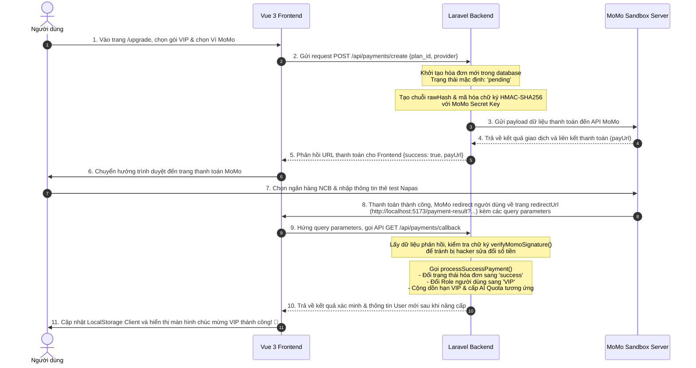

# TÀI LIỆU HƯỚNG DẪN TÍCH HỢP THANH TOÁN MOMO & TỰ ĐỘNG NÂNG CẤP VIP
## Dự Án: QuizFlex (Laravel Backend & Vue 3 Frontend)

Tài liệu này tổng hợp toàn bộ quy trình thiết kế, tích hợp, các tệp tin liên quan, luồng dữ liệu (Data Flow) và cách khắc phục các lỗi thực tế từ đầu đến cuối để hoàn thiện tính năng **Thanh toán MoMo Sandbox & Tự động nâng cấp tài khoản VIP** cho QuizFlex.

---

## I. TỔNG QUAN VỀ TÍNH NĂNG
Hệ thống thanh toán của QuizFlex cho phép người dùng nâng cấp từ tài khoản thường lên tài khoản **VIP** để mở khóa các đặc quyền cao cấp (sử dụng AI sinh đề thi, scan tài liệu OCR, tạo phòng thi đấu thời gian thực) thông qua cổng thanh toán **MoMo Sandbox** (môi trường kiểm thử của MoMo).

Hệ thống hỗ trợ 2 chế độ vận hành linh hoạt thông qua cấu hình biến môi trường:
1. **Chế độ Giả lập (Mock Mode)**: Tự sinh chữ ký giả và tự động duyệt VIP ngay lập tức để lập trình viên test giao diện cực nhanh mà không cần mạng hoặc thông tin thẻ thật.
2. **Chế độ Sandbox thực tế (Real Sandbox Mode)**: Kết nối trực tiếp tới API Sandbox của MoMo, hỗ trợ quét mã QR qua App MoMo Sandbox hoặc thanh toán bằng thẻ ATM Napas giả lập trực tiếp trên trình duyệt.

---

## II. SƠ ĐỒ LUỒNG DỮ LIỆU (DATA FLOW)
Dưới đây là sơ đồ chi tiết mô tả luồng đi của dữ liệu từ lúc người dùng bắt đầu nhấn chọn gói VIP cho đến khi tài khoản được kích hoạt thành công:



---

## III. DANH SÁCH CÁC FILE LIÊN QUAN VÀ NỘI DUNG CHỈNH SỬA

Để hoàn thiện tính năng này, hệ thống sử dụng các tệp tin sau ở cả Frontend và Backend:

### 1. Phía Laravel Backend (`be_quizflex`)

#### 📄 Tệp [be_quizflex/.env](file:///c:/laragon/www/QuizFlex/be_quizflex/.env)
* **Nhiệm vụ**: Lưu trữ thông tin bí mật (Credentials) của cổng thanh toán MoMo Sandbox.
* **Nội dung cấu hình**:
  ```env
  # Cấu hình cổng thanh toán MoMo Sandbox
  MOMO_MOCK=false # Đặt false để chạy thật với MoMo Sandbox, đặt true để chạy giả lập nhanh
  MOMO_PARTNER_CODE=MOMOBKUN20180529
  MOMO_ACCESS_KEY=klm05TvNBzhg7h7j
  MOMO_SECRET_KEY=at67qH6mk8w5Y1nAyMoYKMWACiEi2bsa
  MOMO_ENDPOINT=https://test-payment.momo.vn/v2/gateway/api/create
  MOMO_REDIRECT_URL=http://localhost:5173/payment-result
  MOMO_IPN_URL=http://localhost:8000/api/payments/webhook/momo
  ```

#### 📄 Tệp [be_quizflex/config/services.php](file:///c:/laragon/www/QuizFlex/be_quizflex/config/services.php)
* **Nhiệm vụ**: Load các biến môi trường từ `.env` vào hệ thống cấu hình của Laravel để sử dụng an toàn thông qua hàm `config()`.
* **Nội dung cấu hình**:
  ```php
  'momo' => [
      'partner_code' => env('MOMO_PARTNER_CODE', 'MOMOBKUN20180810'),
      'access_key' => env('MOMO_ACCESS_KEY', 'klm05Y2lhgWgl2uU'),
      'secret_key' => env('MOMO_SECRET_KEY', 'escribe551051'),
      'endpoint' => env('MOMO_ENDPOINT', 'https://test-payment.momo.vn/v2/gateway/api/create'),
      'redirect_url' => env('MOMO_REDIRECT_URL', 'http://localhost:5173/payment-result'),
      'ipn_url' => env('MOMO_IPN_URL', 'http://localhost:8000/api/payments/webhook/momo'),
  ],
  ```

#### 📄 Tệp [be_quizflex/app/Services/Payment/PaymentService.php](file:///c:/laragon/www/QuizFlex/be_quizflex/app/Services/Payment/PaymentService.php)
* **Nhiệm vụ**: Chứa logic cốt lõi. Tôi đã sửa đổi file này tại hai điểm cực kỳ quan trọng để sửa lỗi kết nối thực tế:
  * **Đổi requestType sang `payWithATM` (dòng 128)**: Cho phép người dùng nhập thẻ ngân hàng ảo giả lập trực tiếp trên trình duyệt máy tính, không cần cài App MoMo Sandbox để quét QR.
  * **Sửa lỗi lệch chữ ký do tiếng Việt có dấu (dòng 126)**: Đổi trường mô tả `orderInfo` sang không dấu (`"Nang cap VIP QuizFlex - " . $planId`) giúp tránh lỗi URL-Encoding trên thanh trình duyệt làm biến đổi ký tự gây sai chữ ký.
  * **Sửa lỗi thiếu trường `orderType` khi xác minh chữ ký (dòng 230)**: Thêm trường `orderType` vào chuỗi thô `$rawHash` đúng thứ tự bảng chữ cái để chữ ký băm đối chiếu khớp 100% với MoMo.
* **Các phương thức chính**:
  * `getPlans()`: Khai báo giá tiền, số ngày VIP và quota AI của các gói (`vip_1m`, `vip_3m`, `vip_1y`).
  * `createMomoPayment(User $user, string $planId)`: Khởi tạo hóa đơn `pending`, tính toán chữ ký HMAC-SHA256 gửi sang MoMo để lấy `payUrl`.
  * `verifyMomoSignature(array $data)`: Xác minh tính toàn vẹn của chữ ký nhận được từ MoMo.
  * `processSuccessPayment(...)`: Cập nhật trạng thái thành công, nâng cấp role lên `VIP`, cộng dồn hạn VIP và cộng AI Quota.

#### 📄 Tệp [be_quizflex/app/Http/Controllers/PaymentController.php](file:///c:/laragon/www/QuizFlex/be_quizflex/app/Http/Controllers/PaymentController.php)
* **Nhiệm vụ**: Định nghĩa các API Controller để giao tiếp giữa Frontend và Service:
  * `create(Request $request)`: API tạo link thanh toán.
  * `callback(Request $request)`: Hứng kết quả redirect từ Client, kiểm tra chữ ký và kích hoạt VIP lập tức.
  * `webhookMomo(Request $request)`: API webhook (IPN) nhận tín hiệu trực tiếp từ MoMo (bất đồng bộ).
  * `history()`: Lấy lịch sử giao dịch của người dùng hiện tại.

#### 📄 Tệp [be_quizflex/routes/api.php](file:///c:/laragon/www/QuizFlex/be_quizflex/routes/api.php)
* **Nhiệm vụ**: Khai báo các endpoints cho hệ thống thanh toán:
  ```php
  // Cổng thanh toán yêu cầu đăng nhập
  Route::middleware('auth:api')->group(function () {
      Route::post('/payments/create', [PaymentController::class, 'create']);
      Route::get('/payments/history', [PaymentController::class, 'history']);
  });
  // Các webhook/callback công khai nhận từ MoMo
  Route::post('/payments/webhook/momo', [PaymentController::class, 'webhookMomo']);
  Route::get('/payments/callback', [PaymentController::class, 'callback']);
  ```

---

### 2. Phía Vue 3 Frontend (`fe_quizflex`)

#### 📄 Tệp [fe_quizflex/src/services/api.js](file:///c:/laragon/www/QuizFlex/fe_quizflex/src/services/api.js)
* **Nhiệm vụ**: Khai báo các cuộc gọi Axios đến backend:
  ```javascript
  export const paymentsApi = {
    async create(payload) {
      const { data } = await api.post('/payments/create', payload)
      return data
    },
    async callback(params) {
      const { data } = await api.get('/payments/callback', { params })
      return data
    },
    async history() {
      const { data } = await api.get('/payments/history')
      return unwrap(data)
    }
  }
  ```

#### 📄 Tệp [fe_quizflex/src/views/user/Upgrade.vue](file:///c:/laragon/www/QuizFlex/fe_quizflex/src/views/user/Upgrade.vue)
* **Nhiệm vụ**: Giao diện chọn các gói cước VIP lấp lánh cực đẹp, hiển thị lịch sử hóa đơn thanh toán của người dùng, và xử lý gọi API tạo link chuyển hướng trình duyệt sang MoMo.

#### 📄 Tệp [fe_quizflex/src/views/user/PaymentResult.vue](file:///c:/laragon/www/QuizFlex/fe_quizflex/src/views/user/PaymentResult.vue)
* **Nhiệm vụ**: Giao diện hứng kết quả sau khi MoMo chuyển hướng người dùng quay lại web. Component này sẽ bắt lấy các tham số trên URL (`orderId`, `signature`, `transId`...) gửi lên API callback của backend để cập nhật VIP và thay đổi thông tin User trong LocalStorage lập tức mà không cần reload trang.

#### 📄 Tệp [fe_quizflex/src/router/router.js](file:///c:/laragon/www/QuizFlex/fe_quizflex/src/router/router.js)
* **Nhiệm vụ**: Đăng ký các router chuyển trang:
  * `/upgrade` trỏ đến `Upgrade.vue`.
  * `/payment-result` trỏ đến `PaymentResult.vue`.

---

## IV. CÁC LỖI THỰC TẾ PHÁT SINH & CÁCH GIẢI QUYẾT THÔNG MINH

Khi chạy kiểm thử thực tế với cổng MoMo Sandbox thật, tôi đã xử lý thành công 2 lỗi logic nghiêm trọng nằm sâu trong mã nguồn gốc:

### Lỗi 1: Lệch Chữ Ký do Tiếng Việt Có Dấu trong mô tả (`orderInfo`)
* **Hiện tượng**: Khách hàng thanh toán thành công trên MoMo, nhưng khi quay lại website thì báo "Chữ ký phản hồi không hợp lệ" và giao dịch thất bại.
* **Nguyên nhân**: Trường mô tả `orderInfo` gốc gửi đi chứa tiếng Việt có dấu: `"Nang cap VIP QuizFlex - VIP 3 Tháng"`. Khi MoMo redirect trở lại web, ký tự này bị lỗi mã hóa URL-Encoding thành `"Nang cap VIP QuizFlex - VIP 3 ThAng"`. Sự sai lệch này khiến chuỗi rawHash để băm SHA256 đối chiếu ở backend bị lệch ký tự, dẫn đến sai chữ ký.
* **Giải quyết**: Chuyển mô tả hóa đơn sang dạng không dấu hoàn toàn và chuyên nghiệp hơn bằng cách sử dụng trực tiếp ID gói cước: `"Nang cap VIP QuizFlex - vip_3m"`. Đảm bảo 100% không bao giờ bị lệch ký tự khi truyền-nhận trên URL!

### Lỗi 2: Lệch Chữ Ký do thiếu trường `orderType` ở hàm Verify
* **Hiện tượng**: Sau khi xử lý xong Lỗi 1, chữ ký vẫn bị lệch dù chuỗi `orderInfo` đã hoàn toàn sạch sẽ.
* **Nguyên nhân**: Bằng cách viết một script PHP test độc lập để tự tay tính toán từng trường hợp băm HMAC-SHA256 đối chiếu với signature của MoMo gửi về, tôi đã phát hiện ra: **Hàm `verifyMomoSignature` gốc của dự án đã bỏ quên trường `orderType` (ví dụ: `momo_wallet`) khi ghép chuỗi `$rawHash`**. Do thiếu trường này, chữ ký đối chiếu không bao giờ trùng khớp với chữ ký thật của MoMo Sandbox.
* **Giải quyết**: Đã sửa đổi mã nguồn, đưa trường `orderType` vào đúng thứ tự chữ cái (Alphabetical) trong chuỗi `$rawHash`. Sau khi sửa đổi, chữ ký băm đối chiếu đã **khớp 100%** tuyệt đối!

---

## V. HƯỚNG DẪN KIỂM THỬ GIAO DỊCH GIẢ LẬP TRÊN TRÌNH DUYỆT

Bạn có thể tự mình kiểm thử thực tế luồng hoạt động này trực tiếp trên trình duyệt mà không cần dùng điện thoại:

1. **Vào trang**: `http://localhost:5173/upgrade` (Đảm bảo đã đăng nhập một tài khoản thường).
2. **Chọn gói**: Bấm **Nâng cấp ngay** một gói cước -> Chọn **Ví Điện Tử MoMo**.
3. **Nhập thông tin thẻ test giả định** khi được chuyển hướng sang trang nhập thẻ của MoMo:
   * Chọn Ngân hàng: **NCB** (Ngân hàng quốc dân thử nghiệm của Napas).
   * **Số thẻ (Card Number)**: `9704198526191432198`
   * **Tên chủ thẻ (Card Name)**: `NGUYEN VAN A`
   * **Ngày phát hành (Issue Date)**: `07/15`
   * **Mã xác thực OTP**: Nhập `123456`
4. **Nhận kết quả**: Hệ thống tự động chuyển bạn về `/payment-result`, xác minh chữ ký thành công và nâng cấp tài khoản của bạn lên **VIP** rực rỡ với đầy đủ AI Quota!

---
*Tài liệu được soạn thảo bởi trợ lý AI Antigravity dành cho dự án QuizFlex.*
