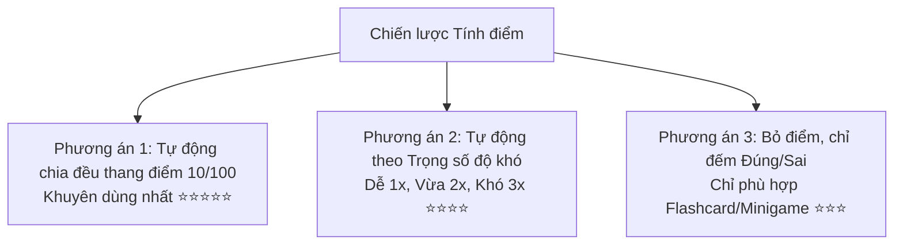

# 📋 KẾ HOẠCH & TÀI LIỆU Ý TƯỞNG NÂNG CẤP HỆ THỐNG QUIZFLEX

> **Tài liệu lưu trữ định hướng kỹ thuật & UX**: Tài liệu này tổng hợp toàn bộ các ý tưởng, kiến trúc thiết kế, công thức tính điểm và lộ trình nâng cấp hệ thống **QuizFlex** (gồm tính năng Tạo Quiz, Chấm điểm thông minh, Nhiều đáp án đúng và Tối ưu trải nghiệm người dùng) để sẵn sàng tiếp tục triển khai trong tương lai.

---

## 📑 MỤC LỤC

1. [Trạng thái các hạng mục đã hoàn thành](#1-trạng-thái-các-hạng-mục-đã-hoàn-thành)
2. [Chiến lược Hệ thống Tính điểm Thông minh (Quiz Scoring System)](#2-chiến-lược-hệ-thống-tính-điểm-thông-minh-quiz-scoring-system)
3. [Kiến trúc Kỹ thuật & Công thức tính điểm](#3-kiến-trúc-kỹ-thuật--công-thức-tính-điểm)
4. [Thiết kế Giao diện Người dùng (UI/UX Guidelines)](#4-thiết-kế-giao-diện-người-dùng-uiux-guidelines)
5. [Lộ trình Triển khai Chi tiết từng Bước (Roadmap)](#5-lộ-trình-triển-khai-chi-tiết-từng-bước-roadmap)

---

## 1. TRẠNG THÁI CÁC HẠNG MỤC ĐÃ HOÀN THÀNH

### ✅ 1.1. Chuẩn hóa Giao diện Tạo Đề thi (`CreateExamView.vue`)

- **Section Headings:** Áp dụng thanh chỉ thị dọc màu tím bo góc (`<span class="h-4 w-1 rounded-full bg-indigo-500"></span> 1. ... 2. ... 3. ...`).
- **Phân bổ Độ khó Tự động:** Loại bỏ nút cộng trừ `+/-` gây rối mắt, chuyển sang ô nhập số trực tiếp (`direct number input`) tinh tế, sạch sẽ.
- **Preset Chips nhanh:** Giữ lại các nút bấm 1 chạm (10 câu cơ bản, 20 câu chuẩn, 25 câu nâng cao).
- **Bộ lọc kho đề:** Hỗ trợ chuyển đổi tab nhanh giữa _Tất cả_, _Kho của tôi_, _Ngân hàng chung_.

### ✅ 1.2. Hỗ trợ Chọn nhiều đáp án đúng (`multi_choice`)

- **Tạo & Sửa câu hỏi (`CreateQuestionView.vue`, `EditQuestionView.vue`):**
  - Thêm bộ chọn chuyển đổi loại câu hỏi (`1 đáp án đúng` vs `Nhiều đáp án đúng`).
  - Đổi linh hoạt giữa **Radio tròn** và **Checkbox vuông**.
  - Validation: `single_choice` yêu cầu đúng 1 đáp án đúng; `multi_choice` yêu cầu tối thiểu 2 đáp án đúng.
- **Làm bài thi (`Quiz.vue`, `HomeworkAssignmentTake.vue`):**
  - Hiển thị nhãn `[NHIỀU ĐÁP ÁN ĐÚNG]`.
  - Hỗ trợ lưu trữ mảng đáp án chọn `selectedAnswers[qId] = ['A', 'C']` và toggle chọn/bỏ chọn mượt mà.
- **Backend & Chấm điểm (`QuestionController.php`, `QuizGradingService.php`):**
  - Đồng bộ trường `type` và `answers.*.is_correct`.
  - Chấm điểm chính xác theo cơ chế so khớp mảng `$selectedIds === $correctIds`.

---

## 2. CHIẾN LƯỢC HỆ THỐNG TÍNH ĐIỂM THÔNG MINH (QUIZ SCORING SYSTEM)

### 📌 Vấn đề thực tế:

Khi người dùng tạo đề thi từ Ngân hàng / Kho câu hỏi (từ 20 đến 50 câu), việc bắt người dùng phải nhập điểm số thủ công cho **từng câu một** là một điểm nghẽn trải nghiệm (UX Friction) lớn: gây mỏi tay, rối mắt và dễ tính nhầm tổng điểm.

### 🎯 3 Phương án đã phân tích & Đánh giá:



### 🏆 ĐỀ XUẤT MÔ HÌNH TỐI ƯU (HYBRID STANDARD):

1. **Khi Tạo Quiz:**
   - Mặc định **Tự động chia đều (Equal Weight)** theo thang điểm 10 chuẩn Việt Nam (hoặc thang 100).
   - Tùy chọn nâng cao (Checkbox): _"Tính điểm theo độ khó câu hỏi"_ (Câu khó nhiều điểm hơn câu dễ).
   - **Hoàn toàn KHÔNG hiển thị ô nhập điểm cho từng câu lẻ** ở trang Tạo đề.
2. **Khi Trả Kết quả thi (`AttemptResult.vue`):**
   - Hiển thị **song song 3 chỉ số** để phục vụ mọi đối tượng:
     - 🎯 **Điểm số quy đổi:** `8.5 / 10 điểm` (hoặc `85 / 100 điểm`).
     - ✅ **Độ chính xác:** `34 / 40 câu đúng (85%)`.
     - ⏱️ **Thời gian làm bài:** `14 phút 30 giây`.

---

## 3. KIẾN TRÚC KỸ THUẬT & CÔNG THỨC TÍNH ĐIỂM

### 3.1. Cấu trúc Dữ liệu Đề xuất (Database Schema Updates)

Nếu muốn lưu cấu hình tính điểm vào bảng `quizzes`:

```sql
ALTER TABLE quizzes
ADD COLUMN scoring_type VARCHAR(30) DEFAULT 'equal_scale' COMMENT 'equal_scale, difficulty_weighted, custom_points',
ADD COLUMN max_score DECIMAL(5,2) DEFAULT 10.00 COMMENT 'Thang điểm tổng của bài thi: 10, 100, ...';
```

### 3.2. Công thức Tính điểm trong `QuizGradingService.php`

#### 🔹 Công thức 1: Chia đều theo Thang điểm (Mặc định - Equal Scale)

Giả sử bài thi có $N$ câu hỏi, thang điểm tổng là $S_{max} = 10$, người thi làm đúng $C$ câu:
$$\text{Điểm đạt được} = \left( \frac{C}{N} \right) \times S_{max}$$
_Ví dụ: Đề 40 câu, làm đúng 35 câu trên thang điểm 10:_
$$\text{Điểm} = \left( \frac{35}{40} \right) \times 10 = 8.75 \text{ điểm}$$

#### 🔹 Công thức 2: Trọng số theo Độ khó (Difficulty Weighted)

Gán hệ số điểm:

- **Dễ (Easy):** Hệ số $W_{easy} = 1$
- **Vừa (Medium):** Hệ số $W_{medium} = 2$
- **Khó (Hard):** Hệ số $W_{hard} = 3$

Tổng trọng số bài thi:
$$W_{total} = \sum_{i=1}^{N} W_i$$
Điểm của mỗi câu hỏi đúng $i$:
$$\text{Điểm câu } i = \frac{W_i}{W_{total}} \times S_{max}$$

---

## 4. THIẾT KẾ GIAO DIỆN NGƯỜI DÙNG (UI/UX GUIDELINES)

### 4.1. Ở trang Tạo Quiz (`CreateExamView.vue` / `CreateExamModal.vue`)

- Giữ nguyên thiết kế tối giản, sạch sẽ hiện tại.
- Tại mục **Cấu hình Đề thi**, có thể thêm một dropdown nhỏ gọn:
  ```html
  <label class="text-xs font-semibold text-slate-700">
    Thang điểm bài thi
    <select class="rounded-xl border border-slate-200 px-3 py-2 text-xs">
      <option value="10">Thang điểm 10 (Mặc định)</option>
      <option value="100">Thang điểm 100</option>
      <option value="weighted">
        Tính theo trọng số độ khó (Dễ 1đ, Vừa 2đ, Khó 3đ)
      </option>
    </select>
  </label>
  ```

### 4.2. Ở trang Soạn thảo từng câu riêng lẻ (`CreateQuestionView.vue`, `EditQuestionView.vue`)

- Giữ ô nhập **"Điểm mặc định"** (`points`) nhỏ gọn cạnh ô chọn Độ khó (mặc định sẵn `10`).

---

## 5. LỘ TRÌNH TRIỂN KHAI CHI TIẾT TỪNG BƯỚC (ROADMAP)

Khi có thời gian tiếp tục thực hiện công việc này, bạn có thể triển khai theo 3 giai đoạn sau:

### 🚀 Giai đoạn 1: Chuẩn hóa hiển thị Thang điểm 10 trên Kết quả thi (Ưu tiên cao)

- [ ] Cập nhật `QuizGradingService.php` trả về thêm trường `scaled_score_10` và `accuracy_percentage`.
- [ ] Cập nhật `AttemptResult.vue` hiển thị huy hiệu điểm số thang 10 nổi bật cạnh số câu đúng `x/y`.
- [ ] Cập nhật trang Lịch sử làm bài (`Results.vue`) hiển thị đồng thời điểm số và tỷ lệ phần trăm.

### 🚀 Giai đoạn 2: Tùy chọn Thang điểm khi Tạo Quiz (CreateExamView)

- [ ] Bổ sung trường `max_score` (10 / 100) vào payload tạo Quiz.
- [ ] Lưu cấu hình vào bảng `quizzes`.
- [ ] Hiển thị thông tin Thang điểm trên thẻ xem trước đề thi (`QuizDetail.vue`).

### 🚀 Giai đoạn 3: Bổ sung Chế độ Chấm điểm theo Độ khó (Difficulty-weighted Scoring)

- [ ] Viết hàm tính toán trọng số động trong `QuizGradingService.php`.
- [ ] Tích hợp tính năng hiển thị điểm từng câu trên bảng tổng kết chi tiết cho Giáo viên trong `HomeworkAssignmentAttempts.vue`.

---

_Tài liệu này được tạo tự động bởi trợ lý phát triển QuizFlex vào ngày 29/08/2026._
